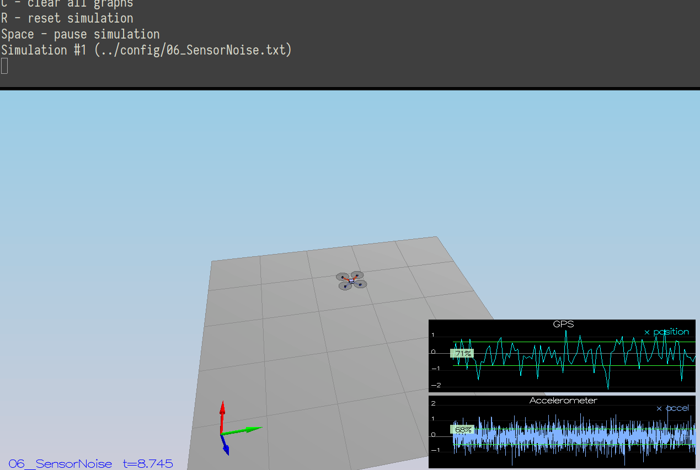
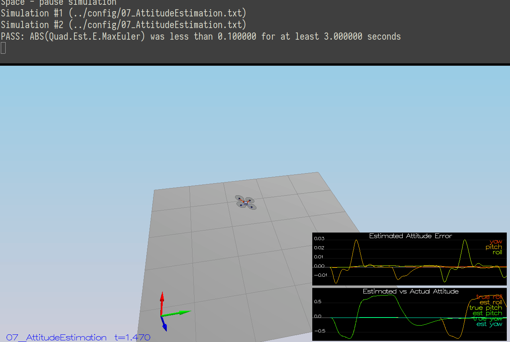
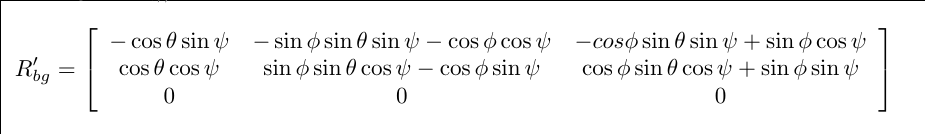
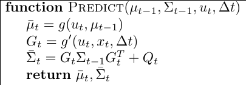
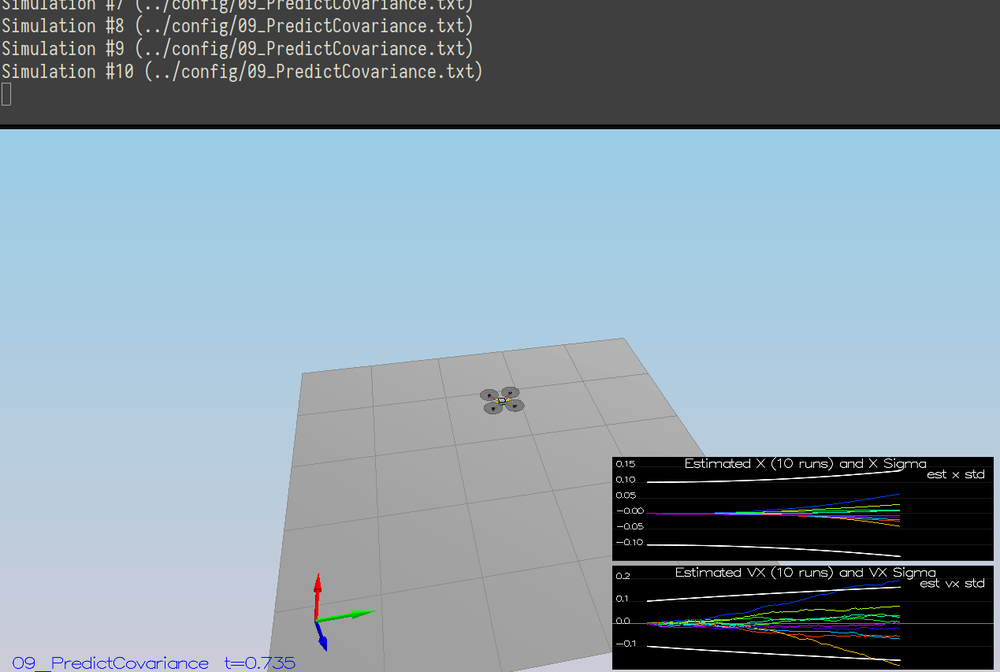
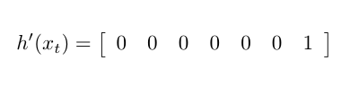
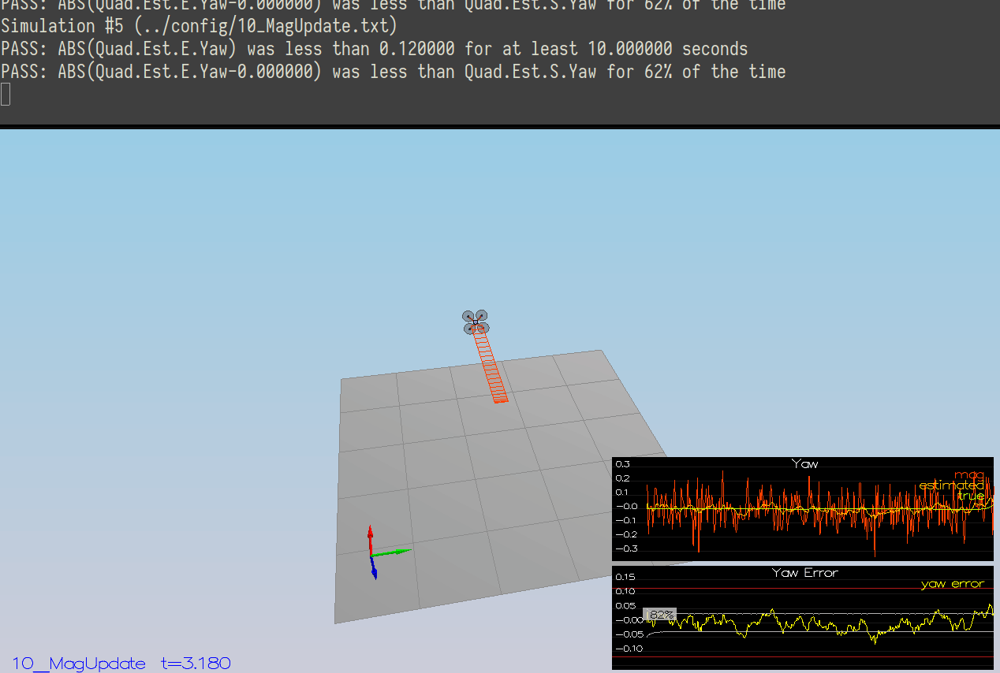
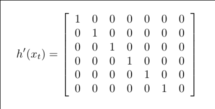

# Estimator Project Writeup

Summary on developing an estimator of the drone controller.

## Step 1: Sensor noice

> Success criteria: Your standard deviations should accurately capture the value of approximately 68% of the respective measurements

The script reads the values and calculates standard devaition.

``` python
import csv
import numpy as np

lines = []
with open('config/log/Graph2.txt') as f:
    reader = csv.reader(f, delimiter=',')
    lines = list(reader)

values = np.array([float(line[1]) for line in lines[1:]])
stdev = np.std(values)
print('stdev =', stdev)
```

With the following values, test passes successfully

```
MeasuredStdDev_GPSPosXY = 0.71
MeasuredStdDev_AccelXY = 0.49
```

<p align="center">
  
</p>

## Step 2: Attitude Estimation

> Success criteria: Your attitude estimator needs to get within 0.1 rad for each of the Euler angles for at least 3 seconds.

I used `FromEuler123_RPY` function from `Quaternion` class for creating a
quaternion from Euler Roll/PitchYaw, and integrated it with `IntegrateBodyRate`.

``` c++
  Quaternion<float> quat = Quaternion<float>::FromEuler123_RPY(rollEst, pitchEst, ekfState(6));
  quat = quat.IntegrateBodyRate(gyro, dtIMU);

  float predictedPitch = quat.Pitch();
  float predictedRoll = quat.Roll();
  ekfState(6) = quat.Yaw();
```

<p align="center">
  
</p>

## Step 3: Prediction Step

> Success criteria: Your goal is to both have an estimated standard deviation that accurately captures the error and maintain an error of less than 0.1rad in heading for at least 10 seconds of the simulation.

I implemented this step using equations from the section
7.2 of the [Estimation for Quadrotors][estimation-for-quadrotors]

`GetRbgPrime` function calculates rotation matrix

<p align="center">
  
</p>

and `Predict` function predict state covariance

<p align="center">
  
</p>

Test looks like this:

<p align="center">
  
</p>

## Step 4: Magentometer Update

> Success criteria: Your objective is to complete the entire simulation cycle with estimated position error of < 1m.

I used equation from the section 7.3.2 of the
[Estimation for Quadrotors][estimation-for-quadrotors]

<p align="center">
  
</p>

<p align="center">
  
</p>

## Step 5: Closed Loop + GPS Update

> Success criteria: Your objective is to complete the entire simulation cycle with estimated position error of < 1m.

The model for the GPS was described in section 7.3.1 of the
[Estimation for Quadrotors][estimation-for-quadrotors]

<p align="center">
  
</p>

<p align="center">
  
</p>

## Step 6: Adding Your Controller

> Success criteria: Your objective is to complete the entire simulation cycle
> with estimated position error of < 1m.

I copied `QuadController.cpp` and `QuadControlParams.txt` from my last project
and it worked without any configuration adjustments.

<p align="center">
  
</p>


[estimation-for-quadrotors]: https://www.overleaf.com/read/vymfngphcccj
